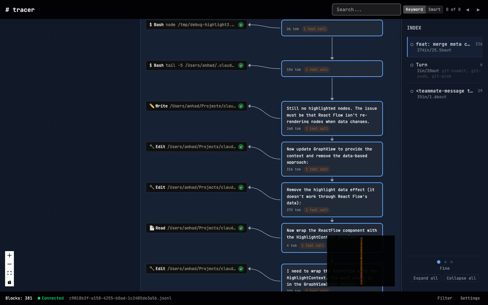
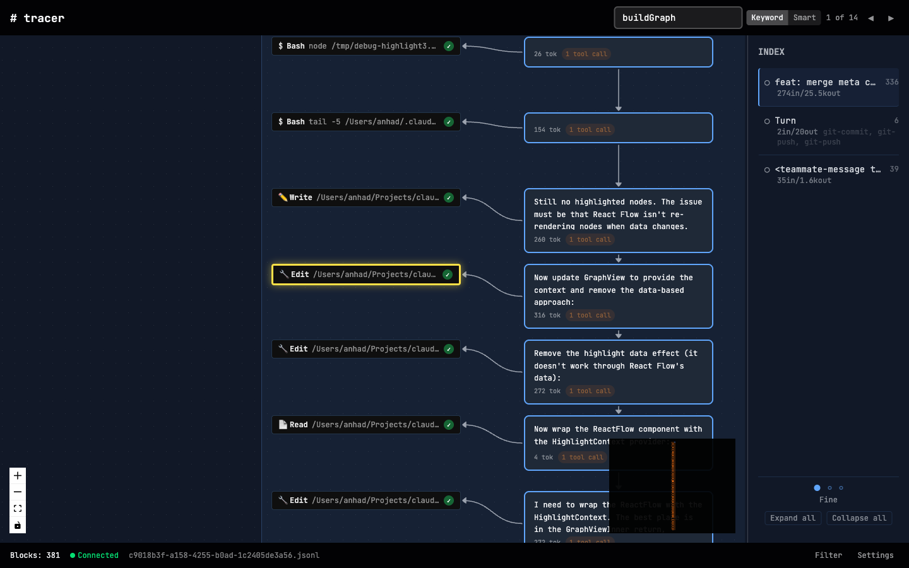
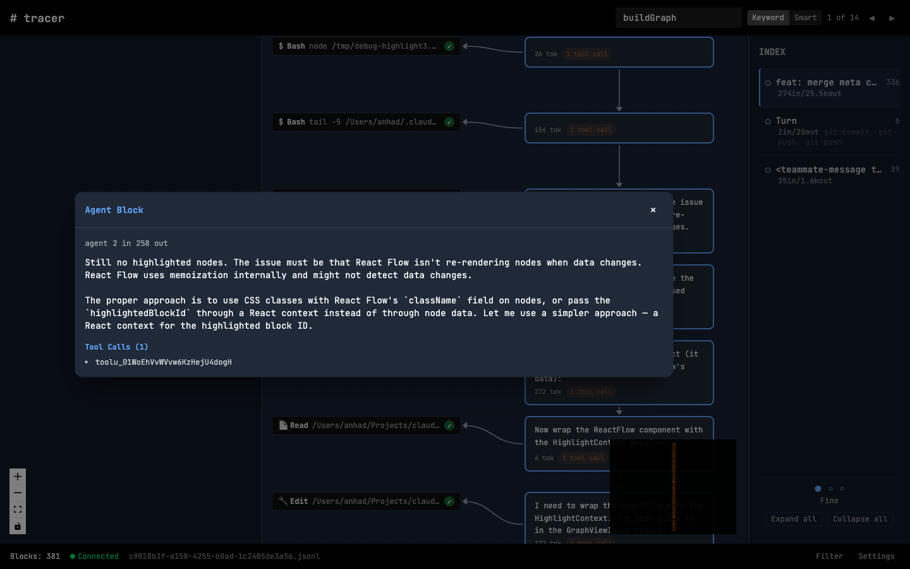
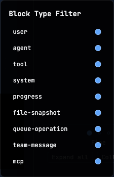
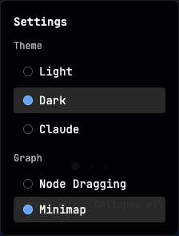

# claude-tracer

Parses Claude Code session JSONL files and renders them as interactive node graphs. Understand long agent sessions, debug tool call chains, track token spend, and review multi-agent coordination — all locally.



## Quickstart

```bash
git clone https://github.com/anhadjaisingh/claude-tracer.git
cd claude-tracer
npm install

# Run with a session file
npm run dev -- -f ~/.claude/projects/<project-hash>/sessions/<session-id>.jsonl
```

Then open [http://localhost:5173](http://localhost:5173).

### Finding session files

Claude Code stores sessions at `~/.claude/projects/<project-hash>/sessions/<session-id>.jsonl`. List recent ones with:

```bash
ls -lt ~/.claude/projects/*/sessions/*.jsonl | head -20
```

## Features

### Graph visualization

Columnar layout where horizontal position encodes nesting depth (user messages right, agent center, tools left) and vertical position encodes time. Collapsible chunk groups, minimap, node dragging, zoom/pan.

### Search

Keyword search (instant, MiniSearch-powered) and smart mode (hybrid keyword + vector). Results navigate the viewport to matched blocks with visual highlighting.



### Block types

Every Claude Code block type gets a dedicated node style: user messages, agent responses, tool calls (Bash, Read, Write, Grep, etc.), MCP calls, sub-agent spawns, slash commands, meta context, team messages, system events, progress indicators, file snapshots, queue operations, and compaction boundaries.

### Block overlay

Click any node to inspect full content, token counts, and tool call details.



### Navigation sidebar

Table of contents with active-chunk highlighting that tracks your viewport position. Three granularity levels: **Fine** (per turn), **Medium** (per task, split at commits/PRs/time gaps), **Coarse** (per theme). Chunk labels derived from commit messages, PR titles, or first user message.

### Filtering and settings

Toggle block types on/off. Three themes (Dark, Light, Claude). Configurable minimap and node dragging.

<p float="left">
  
  
</p>

### Token analytics

Per-block input/output token counts on nodes. Per-chunk aggregated tokens and wall-clock duration in the sidebar.

## Development

**Stack:** TypeScript, React 19, Vite 7, Tailwind CSS v4, Express 5, WebSocket, MiniSearch, React Flow v12.

```bash
npm run dev          # Start Express + Vite dev servers
npm run test:run     # Unit tests (vitest)
npm run test:e2e     # E2E tests (Playwright)
npm run lint         # ESLint
npm run typecheck    # TypeScript check
npm run build        # Production build
```

### Project structure

```
src/
  types/      Shared type definitions (Block, Chunk, etc.)
  parser/     JSONL parser for Claude Code session files
  core/       Chunker (turn/task/theme grouping), search indexing
  server/     Express + WebSocket server, file watching
  ui/         React app (components, hooks, themes)
e2e/          Playwright E2E tests and fixtures
```

## License

MIT
